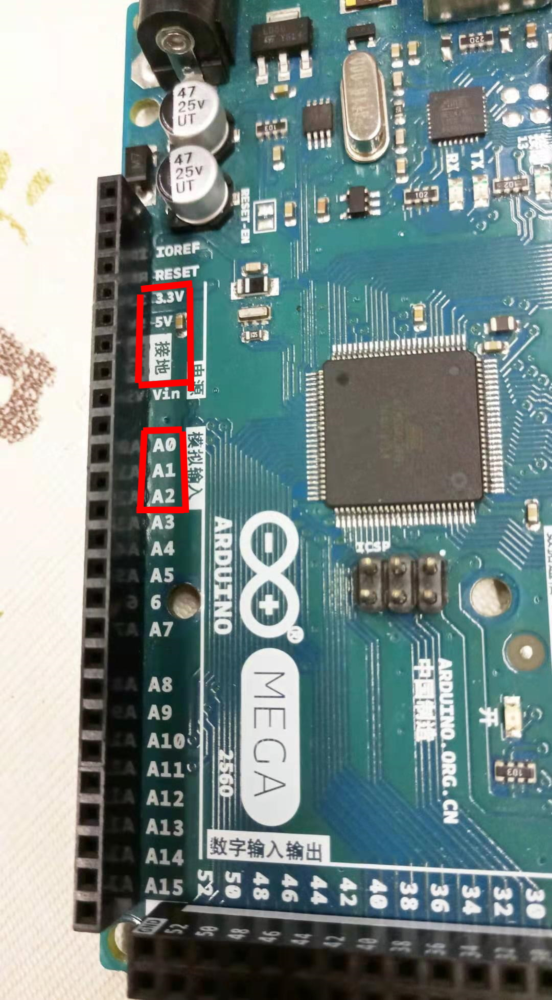
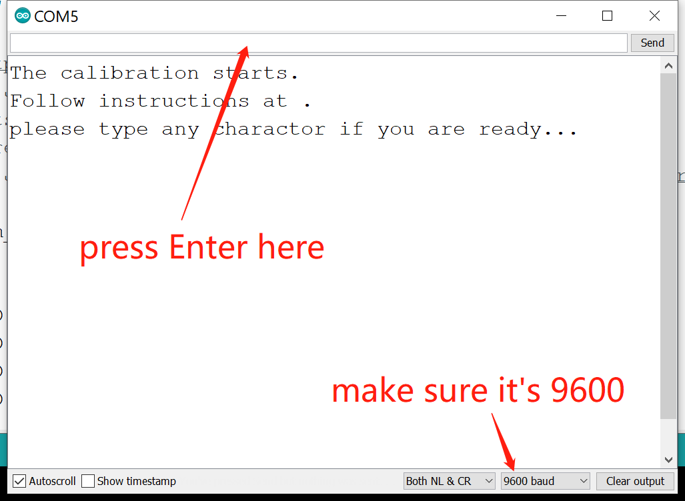
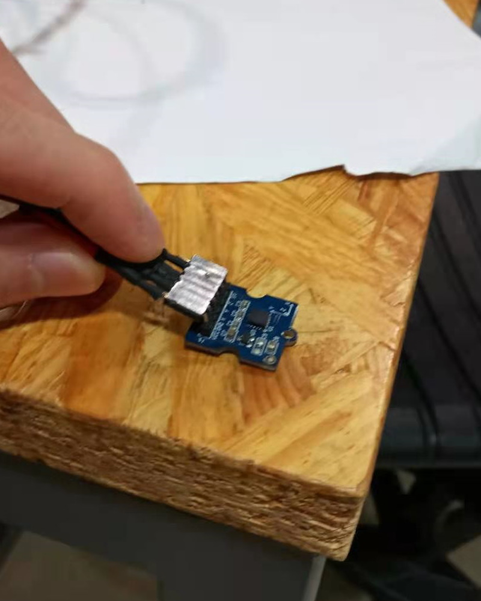
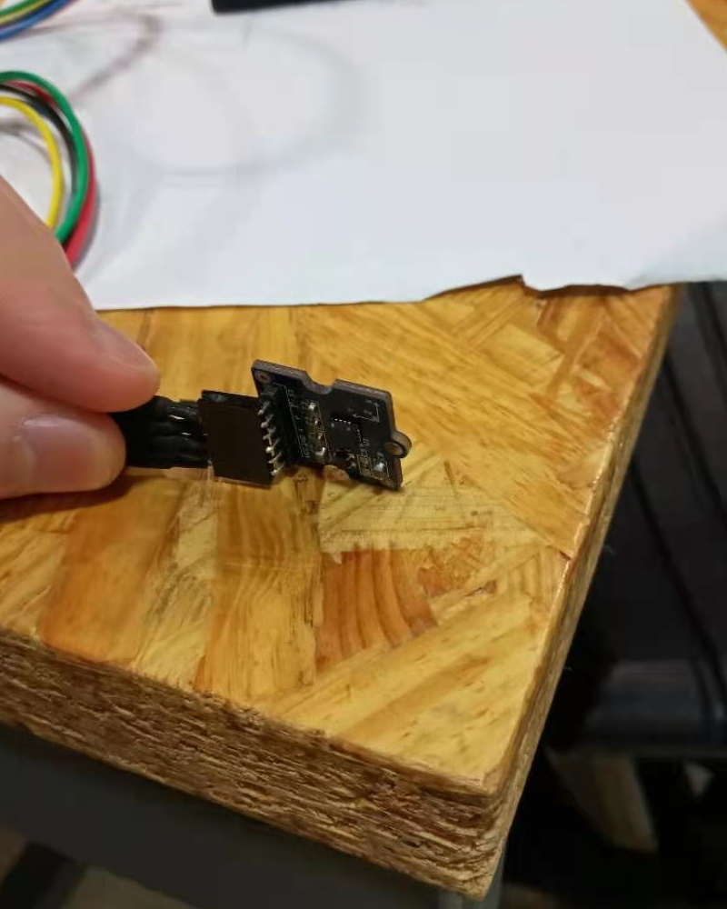
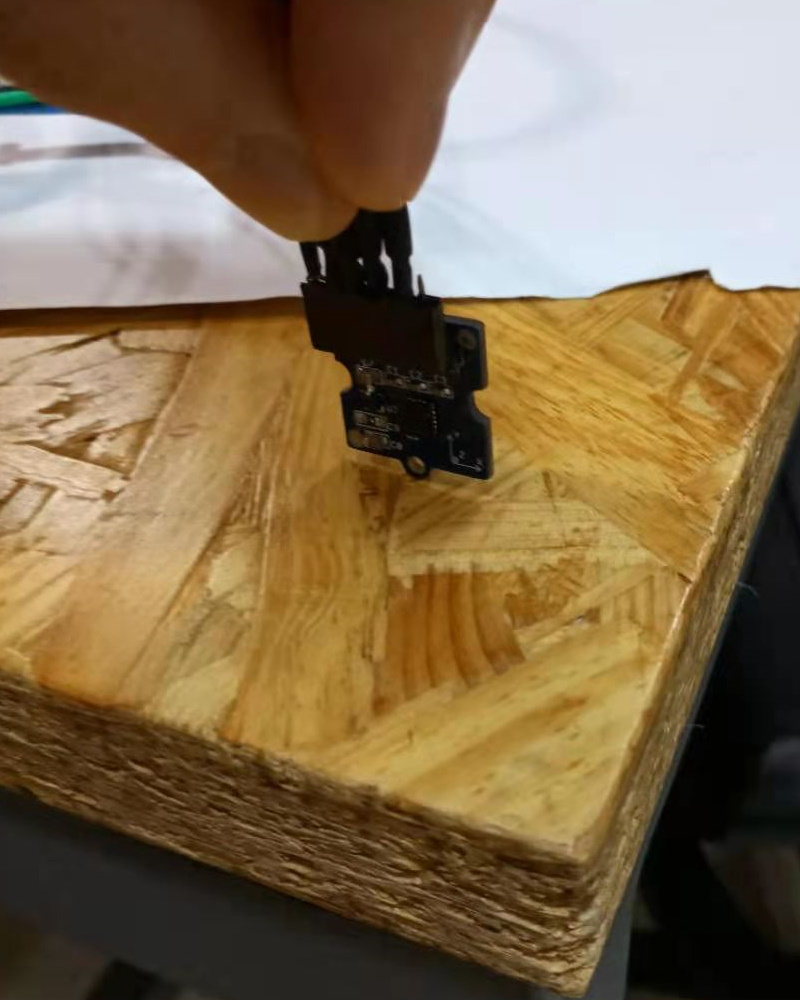
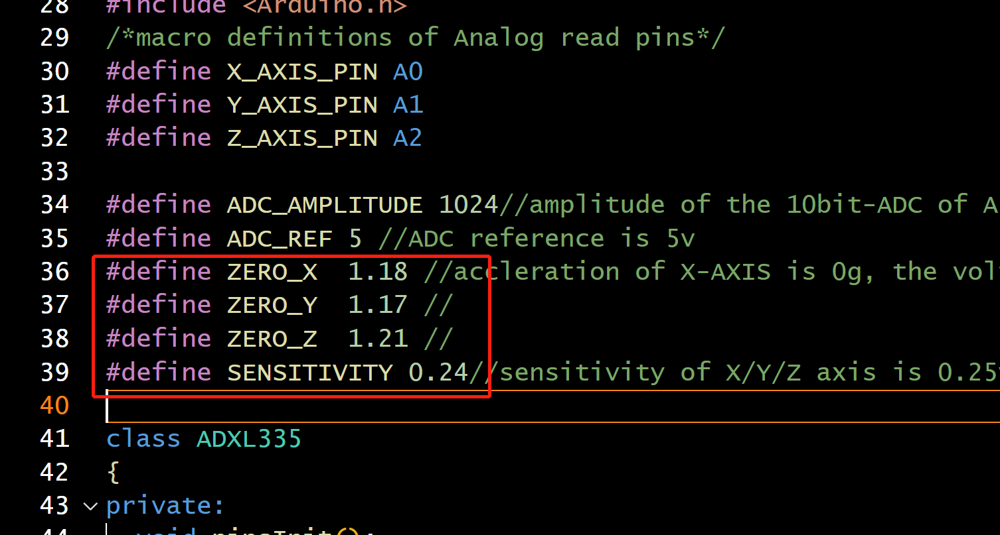

# Three-axis analog accelerometer
This documentation is an improved version based on Grove's [official documentation](https://wiki.seeedstudio.com/Grove-3-Axis_Analog_Accelerometer/). The improvement is made for IMA/B @ NYU Shanghai with a simplified calibration procedure.  

From the [official documentation](https://wiki.seeedstudio.com/Grove-3-Axis_Analog_Accelerometer/):  
> The ADXL335 is a small, thin, low power, complete 3-axis accelerometer with signal conditioned voltage outputs. The product measures acceleration with a minimum full-scale range of ±3 g. 
> 
> The sensor combined 3.3 and 5V power supply.  

## Setup
Connect VCC to 5V or 3.3V, GND to ground, X to analog port A0, Y to A1, and Z to A2.  


Download the [3-Axis Analog Accelerometer Library](https://files.seeedstudio.com/wiki/Grove-3-Axis_Analog_Accelerometer/res/AnalogAccelerometer.zip) and unzip it into the libraries file of Arduino IDE by the path: `..\arduino-1.0.1\libraries`. If having trouble, read the [guide to Arduino library](https://www.arduino.cc/en/guide/libraries).  

## Calibration
You need to calibrate the sensor before using its readings. Download and upload our [calibration script](./Calibration/Calibration.ino) to your Arduino. 

**Notice**: You will orient the sensor in different ways and press a button while the sensor is *perfectly still*. Repeat: the sensor *has to be motionless* when you press the button. Avoid movement and vibration. 

The orientation of the sensor does *NOT* have to be precise. In fact, any four sufficiently different orientations will work.  

To start the calibration procedure, connect the Arduino to your computer and open Serial Monitor. (Make sure the baud rate is set to 9600Hz.) 

You will see "The calibration starts." 


Press Enter in the text bar. 

You will see "Z up." Orient the sensor like this: 
 
and Press Enter in the text bar. 

You will see "X up." Orient the sensor like this: 
 
and Press Enter in the text bar. 

You will see "Y up." Orient the sensor like this: 
 
and Press Enter in the text bar. 

You will see "Z down." Orient the sensor like this: 
 
and Press Enter in the text bar. 

Finally, the calibration script will output some parameters like this:
```
please modify the macro definitions with the below in ADXL335.h
  ZERO_X = XXX
  ZERO_Y = XXX
  ZERO_Z = XXX
  SENSITIVITY = XXX
```

Now, edit the file `ADXL335.h` in the library folder that you previously unzipped. On the top of the file are some macro definitions. Modify them to match the calibration results. 


You are done with the calibration process! Now you may start to use the sensor in your project. 

## Usage example
```cpp
#include "ADXL335.h"

ADXL335 accelerometer;

void setup() {
	Serial.begin(9600);
	accelerometer.begin();
}

void loop() {
  float x;
  float y;
  float z;
  accelerometer.getAcceleration(&x, &y, &z);
  Serial.print(x);
  Serial.print(", ");
  Serial.print(y);
  Serial.print(", ");
  Serial.print(z);
  Serial.println();
}
```
